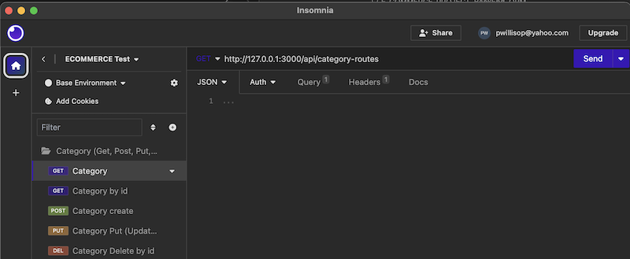
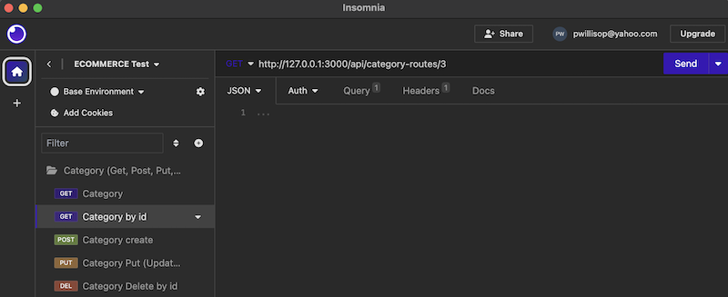
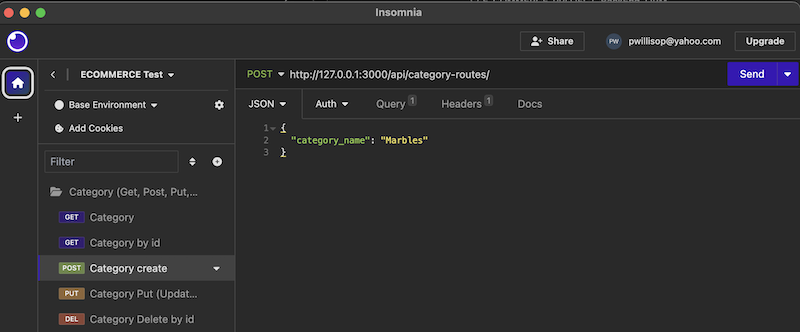
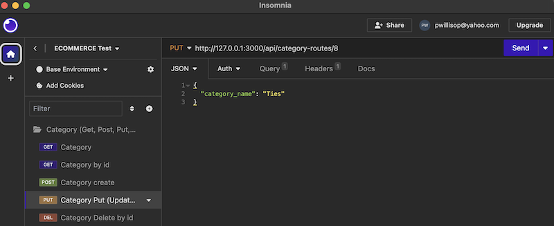
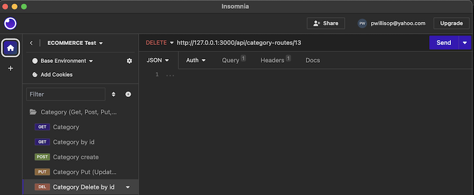

## E-COMMERCE-PROJECT_BackEnd_ORM  

# Description
    - Project was created to explore the workings of the back end functions in order to create an E-commerce set up.
    - Built to support the functionality of (ORM). Use of the relationships in order to route the information to and from the database.
    - The relationships solve the problem of when things are linked together items can be added and removed without damaging the whole heirarchy system. For example a product can be removed without removing tags that may also belong to another project. A Category can be removed with all their associated products.
    - I learned how to create models using sequalizer and how to create the routes that will get, pull, update and delete items from the database.  

## &nbsp;&nbsp;&nbsp;  Installation  
    This repository can be downloaded and then in the terminal enter npm init. cd enter db folder and Log into mysql. enter (source schema;) to get started. Quit and seed the database by entering (node seeds/index.js). Start the server from (nodemon server.js). The server will continue to run until you hit control c.

## &nbsp;&nbsp;&nbsp;  Usage     
 A video showing the walk thru:  
[Click here](https://drive.google.com/file/d/1rjGauBT3XtGK_fem6jHssLyJoJECX__z/view?usp=sharing)  
  
    By using insomnia you can add items using GET. New items can be created by using POST. Updated items can be done by PUT, and deleting items can be done by DEL. All Categories, Products and Tags can be manipulated in this manner. See examples (Note where the id is added in the URL in order to make changes by ID, and also the JSON that needs to be added in order to create or update a category):

## &nbsp;&nbsp;&nbsp;  Contributing  
    This repository was created with the assistants of the TA: Carl Vega, Tutor: Juan Delgado, and the AskBCS Learning assistant, and the new Xpert Learning Assistant.
 
    

# Table of Contents
- [Installation](#installation)
- [Usage](#usage)
- [License](#license)
- [Contributing](#contributing)
- [Questions](#questions)

# License
GNU GPL v3  https://www.gnu.org/licenses/gpl-3.0

# Questions
please contact me with any questions:  
GitHub: https://github.com/PamWillis  
Email: pwillisop@yahoo.com
